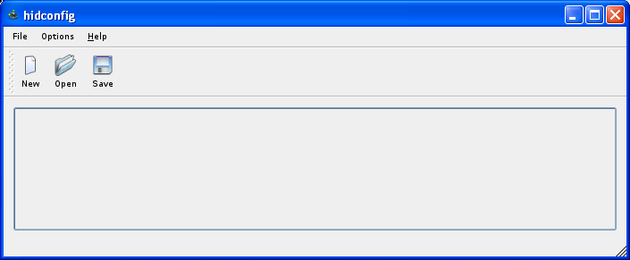
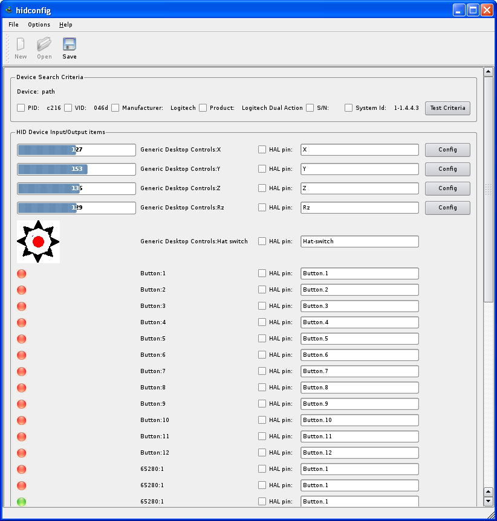

#hidcomp - EMC/LinuxCNC USB HID interface component

		
<ul>
	<li><a href="#introduction">Introduction</a></li>
	<li><a href="#install">Installing hidcomp</a>
		<ul>
			<li><a href="#emcnml">Changes to emc.nml</a></li>
		</ul>
	</li>
	<li><a href="#hidcomp">hidcomp</a>
		<ul>
			<li><a href="#hidcompcontrols">Supported Controls</a></li>
			<li><a href="#hidcompsynopsis">Synopsis</a></li>
			<li><a href="#hidcompoptions">Options</a></li>
			<li><a href="#hidcompusage">Usage</a></li>
			<li><a href="#hidcompexportedpins">Exported Pins</a></li>
		</ul>
	</li>
	<li><a href="#hidconfig">hidconfig</a>
		<ul>
			<li><a href="#hidconfigmainscreen">Main screen</a></li>
			<li><a href="#hidconfigcriteria">Device Search Criteria</a></li>
			<li><a href="#hidconfigitems">HID Device Input/Output items</a></li>
			<li><a href="#hidconfigvalue">Value Config Dialog</a></li>
			<li><a href="#hidconfiglcd">LCD Config Dialog</a></li>
			<li><a href="#lcdexternalaccess">LCD External Access Port</a></li>
		</ul>
	</li>
	<li><a href="#permissions">Permissions</a></li>
	<li><a href="#problemdevices">Problem Devices</a></li>
	<li><a href="#knownissues">Known Issues</a></li>
	<li><a href="#todo">ToDo List</a></li>
	<li><a href="#ChangeHistory">Change History</a></li>
</ul>

				
<h2 id="introduction">Introduction</h2>

		<b>hidcomp</b> is an EMC/LinuxCNC user mode component to provide access to USB HID devices.  A HID device is a 
		Human Interface Device, things like joysticks, gamepads, multimedia controllers (like the Shuttle Pro), 
		and more exotic devices like barcode scanners, alphanumeric displays, medical instruments and home made 
		USB pendants.

		Why another HID interface component when EMC/LinuxCNC already has <b>hal_input</b> and <b>hal_joystick</b>?

<ul>
		<li><b>hidcomp</b> was written to support my home made USB pendant (this is another project, 
		<a href="http://www.franksworkshop.com.au/CNC/GenericHID/index.htm">GenericHID</a>)</li>
		<li><b>hidcomp</b> uses the low level USB protocols and does its own HID interfacing, so it can, or can be modified to, work 
		with non-standard, or just more complex devices.</li>
		<li>It supports additional controls on a device...
			<ul>
				<li>Encoder support, which allows devices like Contour Design's, Shuttle Pro to work</li>
				<li>Alphanumeric displays, currently only supporting text mode displays</li>
				<li>Hat switches.</li>
				<li>Selector switches.</li>
			</ul>
		</li>
		<li>Adds scaling and shaping of analogue inputs (e.g. joystick axis)</li>
		<li><b>hidconfig</b> makes it easier to find and configure HID devices</li>
		<li>Correctly finds and handles multiple identical devices, 
		e.g. 2 Logitech gamepads</li>
</ul>

	What doesn't <b>hidcomp</b> do?

<ul>
	<li>
		It still only provides a set of HAL pins that need to be connected up to other HAL components in a .hal file.  
		<b>hidcomp</b> doesn't help you multiplex buttons and switches.
	</li>
	<li>
		Probably many things.  I wrote <b>hidcomp</b> to support my USB devices, so it has only had minimal testing.  
		However, USB devices are generally pretty simple, so it should work with most.  If it doesn't, 
		because <b>hidcomp</b> was written to interface devices at the lowest level, changes can be made to support
		them.
</ul>
	
<h2 id="install">Installing hidcomp</h2>

<b>hidcomp</b> is only avaiable as this github source project. 
This was last built against LinuxCNC 2.7.4, and on the Debian Wheezy distribution.

	

###Building hidcomp

hidcomp/hidconfig are built against Qt4.5.1 using a static library.  Get these using apt-get on the command line...

	sudo apt-get install qt4-qmake libqt4-dev

The LinuxCNC source is required to build hidcomp.  An environment variable,
`EMCPATH` must be set to point to the linuxcnc directory, eg...

	export EMCPATH=/home/frankt/emc2.core/emc2-dev

To build, first run...

	qmake

then 

	make

the binaries are in `hid/hidcomp/release/hidcomp` and 
`hid/hidconfig/release/hidconfig`.  There is also a debug build.

	
<h3 id="emcnml">Changes to emc.nml/linuxcnc.nml</h3>

In order to support displaying EMC/LinuxCNC information on an LCD display, <b>hidcomp</b> must hook into the EMC/LinuxCNC messaging system.
This is done by adding the following lines to the emc.nml/linuxcnc.nml file.  (The file may be called something else - check for the NML_FILE parameter in the EMC section in the ini file)

<pre>
P hidcomp       emcCommand      LOCAL   localhost       W       0       10.0    0       10
P hidcomp       emcStatus       LOCAL   localhost       R       0       10.0    0       10
P hidcomp       emcError        LOCAL   localhost       R       0       10.0    0       10					
</pre>

Note - this change is only necessary if an LCD module is used.

Note 2 - The NML file now normally lives in /usr/share/linuxcnc/linuxcnc.nml.  To customise your version, copy this file to your config directory and add the hidcomp lines.  
Don't forget to add the NML_FILE parameter to the EMC section of the ini file to tell EMC/LinuxCNC to use your version.

<h2 id="hidcomp">hidcomp</h2>

	The <b>hidcomp</b> component provides a hal representation of a USB HID device.  The pins exposed by <b>hidcomp</b> are defined
	using the <b>hidconfig</b> application.

<h3 id="hidcompcontrols">Supported Controls</h3>
<table class="rowedTable">
	<thead>
		<tr>
			<td>USB Data Type</td>
			<td>Common Usage</td>
			<td>Description</td>
		</tr>
	</thead>
	<tr>
		<td>Input Value 1 Bit</td>
		<td>Button</td>
		<td>An input value which has a 1 bit data length is 
		interpreted as a button, although it could be any digital input.</td>
	</tr>
	<tr>
		<td>Input Value > 1 Bit</td>
		<td>Axis, Selector switch, jog Wheel, volume control</td>
		<td>
			An input value which has a data length greater than 1 bit, has its value exposed as an integer value.  
			This may be an analogue joystick, or a selector switch.
		</td>
	</tr>
	<tr>
		<td>Input Value > 1 Bit, with wrap</td>
		<td>Encoder</td>
		<td>
			When an input value has the wrap bit set in its description, the control is 
			interpreted as an encoder.  
			The wrap bit implies the counter wraps around to 0 when it hits its maximum value (or vice-versa).
		</td>
	</tr>
	<tr>
		<td>Input Value > 1 Bit, usage=HATSWITCH</td>
		<td>Hat switch</td>
		<td>
			The hat switch is a special case of an input value.  The devices sets the control's recommended usage to HATSWITCH.  
			The data is then interpreted as a directional key press.  If the key isn't pressed, an out of range value is returned.
		</td>
	</tr>
	<tr>
		<td>Output Value 1 Bit</td>
		<td>LED</td>
		<td>An output value which has a 1 bit data length is 
		interpreted as an LED, although it could be any digital output.</td>
	</tr>
	<tr>
		<td>Output Value > 1 Bit</td>
		<td>Multi-Colour LED</td>
		<td>The Generic HID device can support bi-colour and tri-colour LEDs, which is how these devices are set.  
		Only a simple integer output is supported at this time.</td>
	</tr>
	<tr>
		<td>USAGE=ALPHA_NUMERIC_DISPLAY</td>
		<td>LCD</td>
		<td>
			

				<b>hidcomp</b> supports standard character only alphanumeric displays.  It has been tested with 1x8, 2x20 and 4x20
				displays, but should be able to cope with any size.
			

			

				This has only been tested against a home made USB Alphanumeric display, and as such, may need to be tweaked to make
				work with other displays.  The requirements at the moment are...
			

			<ul>
				<li>USAGE_ROWS and USAGE_COLUMNS must appear in a feature report.</li>
				<li>USAGE_ROW, USAGE_COLUMN, USAGE_CLEAR_DISPLAY and USAGE_DISPLAY_DATA must appear the output report to render the screen.</li>
				<li>USAGE_DISPLAY_DATA must be a whole line long.</li>
			</ul>
		</td>
	</tr>
</table>
	

<h3 id="hidcompsynopsis">Synopsis</h3>
<blockquote>
	
<b>hidcomp</b> [<u>-ini inifile</u>] [<u>-d</u>] [<u>-n name</u>] configfile ...
	

</blockquote>
	
<h3 id="hidcompoptions">Options</h3>

	<blockquote class="code">
		<b>-ini inifile</b>
		<blockquote>
          The  ini  file  that  is  used  to  start EMC/LinuxCNC.  This defaults to
          emc.ini.  If it is not emc.ini, or in a  location  that  hidcomp
          can't find it, it must be specified.
		</blockquote>              
	</blockquote>              

	<blockquote class="code">
		<b>-d</b>
		<blockquote>
			Turn  on debugging.  Debugging sends volumous amounts of data to
			stderr.  In order to catch the debug, start EMC/LinuxCNC on  the  command
			line and redirect stderr to a file.  For example...
			
			<blockquote class="code">
				/usr/bin/linuxcnc mill.ini 2> logfile
			</blockquote>              
		</blockquote>              
	</blockquote>              

<blockquote class="code">
	<b>-n name</b>
	<blockquote>
				Change  the name of the component as seen by HAL.  The default name is <a class="code">hidcomp</a>.
	</blockquote>              
</blockquote>              

	<blockquote class="code">
		<b>configfile ...</b>
		<blockquote>
				One or more configuration files.  These files are created with the <b>hidconfig</b> application.
				Each device is accessible in HAL as hidcomp.n, where n is the number of the device, starting 
				at zero, as it appears on the command line.
		</blockquote>              
	</blockquote>              

<h3 id="hidcompusage">Usage</h3>

   <b>hidcomp</b>  is  a user space component so it must be loaded into EMC/LinuxCNC using
   <b>loadusr</b>...
	<blockquote class="code">
	      loadusr -W hidcomp -ini lathe.ini pendant.hid
	</blockquote>	
	<b>hidcomp</b> can take a while to start, so it is recommended to use  the  <a class="code">-W</a>
	option of <b>loadusr</b> to wait for the component to start.

If more than one USB device is used, there are two ways 
to support this.&nbsp; First, two configuration files can 
be specified on the command line.&nbsp; For example...

<blockquote class="code">
	      loadusr -W hidcomp -ini lathe.ini pendant1.hid pendant2.hid
</blockquote>						

This will make the two devices available as hidcomp.0.* 
and hidcomp.1.* 

The other way to support multiple devices is to load <b>hidcomp</b> 
multiple times with different names.&nbsp; For example...

<blockquote class="code">
		      loadusr -Wn joypad -name joypad -ini lathe.ini joypad.hid loadusr -Wn 
				gamepad -name gamepad -ini lathe.ini gamepad.hid&nbsp;
</blockquote>	

The devices in the above example can then be accessed 
		as joypad.0.* and gamepad.0.*

<h3 id="hidcompexportedpins">Exported Pins</h3>

	When run, <b>hidcomp</b> will export a large number of pins based on the definition  
	in  the  configuration file.  These can then be used in the EMC/LinuxCNC
	HAL file to control parts of the EMC/LinuxCNC machine, usually via <b>halui(1)</b>.

   The exported pins are defined in the configuration file created by <b>hidconfig</b>.
   The name of each control (button, axis, encoder, etc) can be changed using <b>hidconfig</b>
   but the suffix remains the same.

   <table  class="rowedTable">
   	<thead>
   		<th>Control Type</th>
   		<th>Pin Suffix</th>
   		<th>Data Type</th>
   		<th>Direction</th>
   		<th>Description</th>
   	</thead>
   	<!-- Button -->
   	<tr>
   		<td rowspan="2">Button</td>
   		<td>*.in</td>
			<td>bit</td>
			<td>out</td>
			<td>The button state.  1 when pressed, 0 when not pressed.</td>
   	</tr>
   	<tr>		       		
   		<td>*.in-not</td>
   		<td>bit</td>
			<td>out</td>
   		<td>The inverted button state.  0 when pressed, 1 when not pressed.</td>
   	</tr>
   	
   	<!-- Hatswitch Switch -->
   	<tr>
   		<td rowspan="2">Hat switch</td>
   		<td>*.raw</td>
			<td>s32</td>
			<td>out</td>
			<td>The raw value from hat switch control.  Usually 0 to 7 
		representing the 8 directions, and a number outside this range, 
		e.g. 8, meaning not pressed</td>
   	</tr>
   	<tr>		       		
   		<td>*.direction</td>
   		<td>float</td>
			<td>out</td>
   		<td>The direction the switch has been pressed in degrees, 0-315&deg; for an 8 position switch.  -1 represents no press.</td>
   	</tr>
   	
   	<!-- Value -->
   	<tr>
   		<td rowspan="3">Value (axis)</td>
   		<td>*.raw</td>
			<td>s32</td>
			<td>out</td>
			<td>The raw value from control.  The range varies. </td>
   	</tr>
   	<tr>		       		
   		<td>*.ivalue</td>
   		<td>u32</td>
			<td>out</td>
   		<td>The scaled *.raw value as an u32 type.  Scaling is configured using the <b>hidconfig</b> application.</td>
   	</tr>
   	<tr>		       		
   		<td>*.fvalue</td>
   		<td>float</td>
			<td>out</td>
   		<td>
   			The scaled *.raw value as a float type.  Scaling is configured using the <b>hidconfig</b> application.  
   			Scaling is usually configured by user to make this value range from -1.0 to 1.0
   		</td>
   	</tr>
   	
   	<!-- Encoder -->
   	<tr>
   		<td rowspan="4">Encoder</td>
   		<td>*.raw</td>
			<td>s32</td>
			<td>out</td>
			<td>The raw value from control.  The range varies. </td>
   	</tr>
   	<tr>		       		
   		<td>*.count</td>
   		<td>s32</td>
			<td>out</td>
   		<td>The accumulated count value as an integer.</td>
   	</tr>
   	<tr>		       		
   		<td>*.position</td>
   		<td>float</td>
			<td>out</td>
   		<td>The accumulated count value, scaled to a floating point value.  Scaling is set using the <b>hidconfig</b> application.</td>
   	</tr>
   	<tr>		       		
   		<td>*.reset</td>
   		<td>bit</td>
			<td>io</td>
   		<td>When the bit is set, the counter is reset to 0.  The *.reset bit is then set back to 0.</td>
   	</tr>
   	
   	<!-- LED -->
   	<tr>
   		<td>LED</td>
   		<td>*.out</td>
			<td>bit</td>
			<td>in</td>
			<td>Toggle an LED on and off.  An LED can generically be used as a digital output.</td>
   	</tr>
   	
   	<!-- Output Value -->
   	<tr>
   		<td>Output Value</td>
   		<td>*.ivalue</td>
			<td>s32</td>
			<td>in</td>
			<td>A generic output of data size > 1 bit.</td>
   	</tr>
   	
   	<!-- LCD -->
   	<tr>
   		<td rowspan="7">Alphanumeric Display</td>
   		<td>*.page-select</td>
			<td>s32</td>
			<td>in</td>
			<td>Used to select a page of information on the 
		display.  Pages are user defined using <b>hidconfig</b>.</td>
   	</tr>
   	<tr>		       		
   		<td>*.pages</td>
   		<td>s32</td>
			<td>out</td>
   		<td>Returns the number of user defined pages.  This is a pin so it can be connected to a page turning component to set the maximum number of pages at run time.</td>
   	</tr>
   	<tr>		       		
   		<td>*.max-page</td>
   		<td>s32</td>
			<td>out</td>
   		<td>The same as *.pages - 1.  More useful because pages are number 0 to pages-1.</td>
   	</tr>
   	<tr>		       		
   		<td>*.in-bit-n</td>
   		<td>bit</td>
			<td>in</td>
   		<td>User defined input bit.  Used to display items that are not available from <b>hidcomp</b>'s internal database base.  n can be any integer value.</td>
   	</tr>
   	<tr>		       		
   		<td>*.in-float-n</td>
   		<td>float</td>
			<td>in</td>
   		<td>User defined input float.  Used to display items that are not available from <b>hidcomp</b>'s internal database base.  n can be any integer value.</td>
   	</tr>
   	<tr>		       		
   		<td>*.in-s32-n</td>
   		<td>s32</td>
			<td>in</td>
   		<td>User defined input s32.  Used to display items that are not available from <b>hidcomp</b>'s internal database base.  n can be any integer value.</td>
   	</tr>
   	<tr>		       		
   		<td>*.in-u32-n</td>
   		<td>u32</td>
			<td>in</td>
   		<td>User defined input u32.  Used to display items that are not available from <b>hidcomp</b>'s internal database base.  n can be any integer value.</td>
   	</tr>
   </table>

	The simplest way to list all of the pins is to add the <a class="code">loadusr hidcomp -ini my.ini device.hid<a></acronym> line to an EMC/LinuxCNC hal file, run EMC/LinuxCNC, then browse the pins using the configuration 
	browser.  This is the "Show Hal Configuration" menu option in the "Machine" menu in Axis.

	
<h2 id="hidconfig">hidconfig</h2>

	The <b>hidconfig</b> application is used to create configuration files used by <b>hidcomp</b>.
	This is a convenient way to find devices, identify controls and adjust the function of the controls.

<h2 id="hidconfigmainscreen">Main screen</h2>

	<b>hidconfig</b> is run from the command line...
	<blockquote class="code">
	hidconfig [file.hid]
	</blockquote>
	optionally specifying an existing configuration file to edit.  The default extension for the hidcomp configuration files is ".hid".

	hidconfig is a graphical application built using Qt, so a graphical Windowing System must be running.  The next image shows the start up screen.

	

	To create a new configuration, hit the "New" button on the tool bar, or select "New" from the "File" menu.  Alternatively, an existing file can be opened
	using the "Open" button, or "Open" menu item.  

	Selecting "New" will prompt with the "Select Device" dialog, shown below.

	The "Select Device" dialog box will show a list of USB HID devices that have been recognised by <b>hidconfig</b>.  Those devices that <b>hidconfig</b> has
	permission to access are shown with the full manufacturer name and device name.  When <b>hidconfig</b> doesn't have permission to access a USB HID device, 
	only the vendor id (VID) and product id (PID) are shown, with an asterisk (*) next to the name.

  If all devices appear with an asterisk, you will not be able to configure any devices.  The correct solution is set up the udev permissions correctly.  See the 
  section on <a href=#permissions>permissions</a>.  A quick and dirty work around is to run hidconfig as root, 	i.e. use...
<blockquote class="code">sudo hidconfig</blockquote>			
  But that is only a temporary solution.  <b>hidcomp</b> wont work, and any configuration file you create will have <a class="code">root</a> ownership permissions which you need to address.	  

	When a device is loaded, hidconfig will show all the available controls in a functional display.  Below is an screen shot of my 
	Logitech dual action game pad.

	The window is broken up into two parts: the "Device Search Criteria" frame (top part), and the "HID Device Input/Output items" (the large bottom part).

<h4 id="hidconfigcriteria">Device Search Criteria</h4>

	The "Device Search Criteria" is used to identify the USB device.  Most applications only use the VID and PID (Vendor ID and Product ID).  This
	is fine if you only have one device.

	If you only have one USB device, mark the PID and VID checkboxes.

	This wont work, however, if you have more than one of the same device.  You need to specify additional attributes to check when searching for the USB
	device.  These can be the Manufacturer name, the Product name, the Serial Number (S/N), or the system id.

	The Manufacturer name, Product name, and Serial Number are self 
	explanatory and generally wont vary across identical devices.  The system id, will 
	always be
	unique.  It represents the USB port that the device is plugged into.  For two identical devices, this is the only way to distinguish them.  As long as 
	the device isn't moved from one USB port to another, it will always locate the same device.

	The "Test Criteria" button can be used to check how many devices are found using the current criteria.  You will be warned when saving the file if
	the criteria doesn't match exactly one device.  <b style="color:red">This is important.  If hidconfig cannot uniquely identify the device specified in the configuration file
	it will not be able to reload the file.  Similarly, hidcomp will not be able to locate the USB device</b>.

<h4 id="hidconfigitems">HID Device Input/Output items</h4>

The majority of the <b>hidconfig</b> display shows all of the USB device's controls and configuration laid out in a table.

	Each row represents one of the device's controls.  On the Logitech gamepad shown above, 
	the first 4 rows show the joystick axis, then one row for the 
	hat switch, 12 rows for the buttons
	and then 23 rows (only the first 3 shown) for some undocumented gamepad magic.

	There are 5 columns in the table.

<ol>
	<li>Current Value - this shows the current raw value of the USB Device control.  Use this to test and identify which control is which on the device.</li>
	<li>USB Name - the shows the USB Device allocated Usage Page and Usage.  These are the suggested usages of the control. </li>
	<li>Enabled Check Box - unless the check box is ticked, the control will not be available.</li>
	<li>Hal Pin name - the unique pin name (prefix) for the control.  This can be set to any meaningful name.  The name must be unique among enabled pins.  
	    The total name length (hidcomp.n.&lt;pin name&gt;.suffixes) must not be more than 40 characters.  This is checked before the configuration file is saved.</li>
	<li>Configuration button - some controls, value type and LCDs have additional configuration that can be accessed via the button.  </li>
</ol>
<h4 id="hidconfigvalue">Value Config Dialog</h4>

The Value Config Dialog is used to customise USB value controls.  A screen shot is shown below.

<h5>Overrides</h5>

	The first section of the dialog is the Overrides section.  This allows modification of controls 
	that don't behave as expected.  Currently, the only control that misbehaves is the Wheel on 
	the Shuttle Pro, which claims a Logical Min/Max of -128/127, but only generates values of -7/7.

	The Type combo box doesn't do anything.  Yet.

<h5>Output</h5>

	The Output section controls the scaling of output values.  Specify a min/max value, and
	the control's logical min/max will be scaled between them.  The output type combo box is
	not used, as both a floating point scaled value (.fvalue) and a scaled integer value (.ivalue)
	are output.

	The Reverse Axis check box will reverse the direction of the value.  This can also be accomplished 
	by swapping the min/max values (although the changes will only be visible when using the device in hidcomp).

<h5>Response</h5>

	Checking the Use Response Curve check box will enable the response curve.  This allows the 
	behaviour of an axis to be changed.  In the example above, there is a dead zone specified
	in the middle, and a non-linear behaviour when moved.

	The display is broken up into two parts.  The response curve plot, which shows the position of the raw input
	value as a vertical red line, and the control output, displayed as a single bar.

	The nodes on the curve can be moved, added and deleted.  When the mouse cursor is over a 
	node, the mouse pointer will change to a hand.  Click and drag the node. 

	Nodes are deleted by right clicking on them and selecting delete node from the context menu.

	Nodes can be added by right clicking anywhere on the line and selecting add node from the context menu.

	If changes are made to the curve, the curve is save as the "Custom" curve.  The buttons at the 
	bottom, "1", "2", "3", "4", and "Custom" can be used to cycle through the built-in curves and the custom
	curve.  If a built-in curve is changed, the changes are saved to the custom curve.

	The Snap to Grid check box helps align nodes.  It only assists when moving nodes.  It doesn't automatically 
	move nodes that aren't aligned to the grid.

<h4 id="hidconfiglcd">LCD Config Dialog</h4>

The LCD (Alphanumeric Display) interface is implemented as a series of pages containing display fields.
Multiple pages can be defined and then selected using the *.page-select hal pin.  Each page contains
a series of formatted data fields.  These fields display values that are present on hal input pins,
or via a list of predefined values that hidcomp knows about.

The LCD Configuration dialog is shown below

<h5>Pages</h5>

On the left side of the dialog is the pages list.  The "New Page" and "Delete Page" buttons below the
list are used to add and remove pages.

Pages are always numbered consecutively from 0.  The "Page Name" in the list is only used in <b>hidconfig</b>
for information.

The up and down arrows to the right of the page list is used to change the order of the pages.  Moving
pages will change the page number.

				

In the example above, there are 3 pages.  The main page, #0, is the default and will be shown at start-up.
A button is wired to the hal updown counter component then wired to the .page-select pin to cycle through the
pages.  The tool change page, #2, is configured to be selected when a tool change is requested.

				
<h5>LCD Display</h5>

The top right section of the dialog shows a simulated LCD display.  It will show the contents of each
page as the page items are edited.  The same display will also be shown on the LCD display of the USB Device.

<h5>Display Items</h5>

The table underneath the LCD display contains a list of all of the fields that will be displayed on a page.  The example
above shows an overly complex display, but is a good example of what can be done.

The table has 7 columns...

<table  class="rowedTable">
<thead>
	<tr>
		<th>Column</th>
		<th>Description</th>
	</tr>
</thead>
<tr>
	<td>Col</td>
	<td>The column number that data is to appear on.  Column numbers start at 0.</td>
</tr>
<tr>
	<td>Row</td>
	<td>The row number that data is to appear on.  Row numbers start at 0.</td>
</tr>
<tr>
	<td>Value</td>
	<td>What is to be displayed.  This can be one of the build in data fields, or an external pin.  The fields are listed below.</td>
</tr>
<tr>
	<td>Format</td>
	<td>How the data is formatted.  More on this below.</td>
</tr>
<tr>
	<td>Scale</td>
	<td>A multiplier applied to the data before it is displayed.  Only used on integer and floating point data fields.  Typically used to convert 0-1 to 0-100%, or unit conversions.</td>
</tr>
<tr>
	<td>Index</td>
	<td>Some data fields require an additional index.  For example, the Actual Position field, requires an index to 
	specify the axis (0=x, 1=y, 2=z, etc).  When a format is selected, a tool tip will describe if an index is required.</td>
</tr>
<tr>
	<td>Test Value</td>
	<td>Used to populate the LCD display with sample data.  Use this field to test all values that may displayed in the LCD.  In particular test min/max values
	to ensure fields don't overflow.</td>
</tr>
</table>

The "Refresh Period (ms)" field specifies how often the display should be updated.

<h4>Data Values</h4>

The data values displayed on the LCD can be selected from the internal database of known values, 
or a data value that has been set via an input pin.  The list of all data values 
is listed in the table below...

<table>
<col class=code></col>
<col></col>
<tr>
	<td>Operator Error</td>
	<td>Operator Error Messages</td>
</tr>
<tr>
	<td>Operator Text</td>
	<td>Operator Text Messages</td>
</tr>
<tr>
	<td>Operator Display</td>
	<td>Operator Display Messages</td>
</tr>
<tr>
	<td>Operator Message</td>
	<td>The last Operator Messages</td>
</tr>
<tr>
	<td>Mode</td>
	<td>EMC/LinuxCNC Task Mode - 1=Manual, 2=Auto, 3=MDI</td>
</tr>
<tr>
	<td>State</td>
	<td>EMC/LinuxCNC Task State - 1=E-Stop, 2=E-Stop/Reset, 3=Off, 
	4=On</td>
</tr>
<tr>
	<td>Execution State</td>
	<td>EMC/LinuxCNC Executing state 1=Error, 2=Done, 3=Waiting for 
	Motion, 4=Waiting for Motion Queue, 5=Waiting for IO, 
	6=Waiting for Pause, 7=Waiting for Motion and IO, 
	8=Waiting for Delay, 9=Waiting for System Cmd</td>
</tr>
<tr>
	<td>Interpreter State</td>
	<td>EMC/LinuxCNC Interpreter state - 1=Idle, 2=Reading, 
	3=Paused, 4=Waiting </td>
</tr>
<tr>
	<td>Motion Line</td>
	<td>The line in the GCode file that corresponds to the 
	current motion position </td>
</tr>
<tr>
	<td>Current Line</td>
	<td>The line in the GCode file that corresponds to the 
	line the interpreter is looking at </td>
</tr>
<tr>
	<td>Optional Stop State</td>
	<td>Optional Stop State </td>
</tr>
<tr>
	<td>Block Delete State</td>
	<td>Block Delete State </td>
</tr>
<tr>
	<td>GCode File Path</td>
	<td>The full path of the current GCode program </td>
</tr>
<tr>
	<td>GCode File Name</td>
	<td>The file name of the current GCode program </td>
</tr>
<tr>
	<td>GCode Command</td>
	<td>The current GCode command being interpreted </td>
</tr>
<tr>
	<td>Active GCodes</td>
	<td>Active GCodes. Index from 0 to 15 </td>
</tr>
<tr>
	<td>Active MCodes</td>
	<td>Active MCodes. Index from 0 to 9 </td>
</tr>
<tr>
	<td>Active Settings</td>
	<td>Active settings. Index from 0 to 2 </td>
</tr>
<tr>
	<td>Paused</td>
	<td>Task Paused </td>
</tr>
<tr>
	<td>Trajectory Mode</td>
	<td>Trajectory Mode 1=Free, 2=Coord, 3=Teleop </td>
</tr>
<tr>
	<td>Trajectory Enabled</td>
	<td>Trajectory Enabled </td>
</tr>
<tr>
	<td>In Position</td>
	<td>Motion in position </td>
</tr>
<tr>
	<td>Paused</td>
	<td>Motion paused </td>
</tr>
<tr>
	<td>Commanded Position[axis]</td>
	<td>Commanded Position for each axis. Axis numbers from 
	0-8 represent axis x,y,z,a,b,c,u,v,w </td>
</tr>
<tr>
	<td>Actual Position[axis]</td>
	<td>Actual Position for each axis. Axis numbers from 0-8 
	represent axis x,y,z,a,b,c,u,v,w </td>
</tr>
<tr>
	<td>System Velocity</td>
	<td>System velocity for subsequent moves </td>
</tr>
<tr>
	<td>System Acceleration</td>
	<td>System acceleration for subsequent moves </td>
</tr>
<tr>
	<td>Last Probe Trip Pos[axis]</td>
	<td>Last probe trip position for each axis. Axis numbers 
	from 0-8 represent axis x,y,z,a,b,c,u,v,w </td>
</tr>
<tr>
	<td>Probe Tripped</td>
	<td>Probe tripped since last clear // int 
	EMC_TRAJ_STAT.probe_tripped; // Has the probe been 
	tripped since the last // clear.</td>
</tr>
<tr>
	<td>Probing</td>
	<td>We are currently probing </td>
</tr>
<tr>
	<td>Probe Value</td>
	<td>Current probe value </td>
</tr>
<tr>
	<td>Distance to Go</td>
	<td>Distance to go in current move </td>
</tr>
<tr>
	<td>Distance to Go[axis]</td>
	<td>Distance to go for each individual axis. Axis 
	numbers from 0-8 represent axis x,y,z,a,b,c,u,v,w </td>
</tr>
<tr>
	<td>Current Velocity</td>
<td>Velocity of current move </td>
</tr>
<tr>
	<td>Feedrate Override Enabled</td>
	<td>Feedrate override enabled </td>
</tr>
<tr>
	<td>Spindle Override Enabled</td>
	<td>Spindle override enabled </td>
</tr>
<tr>
	<td>Adaptive Feed Enabled</td>
	<td>Adaptive feed enabled </td>
</tr>
<tr>
	<td>Feed Hold Enabled</td>
	<td>Feed Hold Enabled </td>
</tr>
<tr>
	<td>FError[axis]</td>
	<td>Current following error for this axis. Axis numbers 
	from 0-8 represent axis x,y,z,a,b,c,u,v,w </td>
</tr>
<tr>
	<td>Command Output Position[axis]</td>
	<td>Current Command Position for this axis. Axis numbers 
	from 0-8 represent axis x,y,z,a,b,c,u,v,w </td>
</tr>
<tr>
	<td>Current Input Position[axis]</td>
	<td>Current Input Position for this axis. Axis numbers 
	from 0-8 represent axis x,y,z,a,b,c,u,v,w </td>
</tr>
<tr>
	<td>In Position[axis]</td>
	<td>The axis is currently at the requested position. 
	Axis numbers from 0-8 represent axis x,y,z,a,b,c,u,v,w 
	</td>
</tr>
<tr>
	<td>Homing[axis]</td>
	<td>The axis is currently homing. Axis numbers from 0-8 
	represent axis x,y,z,a,b,c,u,v,w </td>
</tr>
<tr>
	<td>Homed[axis]</td>
	<td>The axis is homed. Axis numbers from 0-8 represent 
	axis x,y,z,a,b,c,u,v,w </td>
</tr>
<tr>
	<td>Fault[axis]</td>
	<td>The axis has faulted. Axis numbers from 0-8 
	represent axis x,y,z,a,b,c,u,v,w </td>
</tr>
<tr>
	<td>Enabled[axis]</td>
	<td>The axis is enabled. Axis numbers from 0-8 represent 
	axis x,y,z,a,b,c,u,v,w </td>
</tr>
<tr>
	<td>Min Soft Limit[axis]</td>
	<td>The axis has exceeded the min soft limit. Axis 
	numbers from 0-8 represent axis x,y,z,a,b,c,u,v,w </td>
</tr>
<tr>
	<td>Max Soft Limit[axis]</td>
	<td>The axis has exceeded the max soft limit. Axis 
	numbers from 0-8 represent axis x,y,z,a,b,c,u,v,w </td>
</tr>
<tr>
	<td>Min Hard Limit[axis]</td>
	<td>The axis has exceeded the min hard limit. Axis 
	numbers from 0-8 represent axis x,y,z,a,b,c,u,v,w </td>
</tr>
<tr>
	<td>Max Hard Limit[axis]</td>
	<td>The axis has exceeded the max hard limit. Axis 
	numbers from 0-8 represent axis x,y,z,a,b,c,u,v,w </td>
</tr>
<tr>
	<td>Override Limits[axis]</td>
	<td>Override the limits. Axis numbers from 0-8 represent 
	axis x,y,z,a,b,c,u,v,w </td>
</tr>
<tr>
	<td>Spindle Speed</td>
			<td>Spindle speed in RPM </td>
		</tr>
		<tr>
			<td>Spindle Direction</td>
			<td>Spindle direction. 0=stopped, 1=forward, 
			-1=reverse </td>
		</tr>
		<tr>
			<td>Spindle Brake</td>
			<td>Spindle brake. 0=released, 1=engaged </td>
		</tr>
		<tr>
			<td>Spindle Increasing</td>
			<td>Spindle Speed Increasing. 1=increasing, 
			-1=decreasing, 0=steady </td>
		</tr>
		<tr>
			<td>Spindle Enabled</td>
			<td>Spindle enabled </td>
		</tr>
		<tr>
			<td>Tool Prepped</td>
			<td>Tool ready for loading. 0 is no tool </td>
		</tr>
		<tr>
			<td>Tool In Spindle</td>
			<td>Tool in spindle. 0 is no tool</td>
		</tr>
		<tr>
			<td>Coolant-Mist</td>
			<td>Mist coolant. 0 - off, 1 - on </td>
		</tr>
		<tr>
			<td>Coolant-Flood</td>
			<td>Flood coolant. 0 - off, 1 - on </td>
		</tr>
		<tr>
			<td>E-Stop</td>
			<td>E-Stop - 0 means run, 1 stopped </td>
		</tr>
		<tr>
			<td>Lube On</td>
			<td>Lube on - 0=off, 1=on </td>
		</tr>
		<tr>
			<td>Lube Level</td>
			<td>Lube level - 0=low, 1=okay </td>
		</tr>
		<tr>
			<td>User S32[index]</td>
			<td>Custom User S32 value on pin 
			&lt;device&gt;.lcd-s32-&lt;index&gt;. Any Index values can 
			be used </td>
		</tr>
		<tr>
			<td>User U32[index]</td>
			<td>Custom User U32 value on pin 
			&lt;device&gt;.lcd-u32-&lt;index&gt;. Any Index values can 
			be used </td>
</tr>
<tr>
	<td>User Float[index]</td>
	<td>Custom User Float value on pin &lt;device&gt;.lcd-float-&lt;index&gt;. 
	Any Index values can be used </td>
</tr>
<tr>
	<td>User Bit[index]</td>
	<td>Custom User Bit value on pin &lt;device&gt;.lcd-bit-&lt;index&gt;. 
	Any Index values can be used </td>
</tr>
</table>

The last four rows show how to set up user defined data sources.  By specifying a User data type and an index, 
<b>hidcomp</b> will provide a hal input pin for custom data.  For example, selecting "User U32[index]" and index 17, <b>hidcomp</b> will
create an input pin <a class="code">hidcomp.0.LCD.in-u32-17</a>

<h4>Format</h4>

The LCD data fields are formatted using <b>printf</b> format strings.  A format string can contains plain text and optionally an embedded format tag of the form...
<blockquote class="code">%[flags][width][.precision][length]specifier </blockquote>
Note - it only make sense to use the correct format string for the correct data type, 
i.e. %d,%u for integers, %f,%g,%e for floating point values, etc.  Using the incorrect
format specifier will produce unpredictable results.

For a detailed description of the format string, see the <b>printf(3)</b> man page or do an internet search on <b>printf</b>.

In addition to all the standard printf format strings, a custom enumeration type, %b is also supported.  The syntax of this format is as follows...

<blockquote class="code">%[flags][width][.precision][length]:id,string[:id,string]:b</blockquote>
>
As you can see, the format is the same as the <b>printf</b> syntax followed by a colon separated list of (id,string) pairs, followed by the specifier, b. 
id, is an integer that is matched against input data and the 
matching string is used as the output.&nbsp; The id,string 
pair is used as the default when the data value does not 
match.&nbsp; Internally, when the string is formatted, the (id,value):b 
data is stripped out and replaced with the s specifier, 
turning the format into a string format.&nbsp; It only makes 
sense to use this format for integer data.&nbsp;  

For example, in the screen shot above, line 4 shows how to display an * (asterisk) when an axis has not been homed...

<blockquote class="code">%1:0,*:1, :b</blockquote>
The formatting starts with the % (percent symbol) to indicate the formatting tag, followed by a 1 (one) to specify the field width.  So far is a standard
<b>printf</b> format.  Then comes the : (colon), which indicates the first id,string pair.  The first pair is 0,* which means if the data value is 0, display a *.  The next
pair is 1, (one comma space), which means if the value is one, display a space character.  Additionally, because it is the last pair, a space character will be displayed if
any other value is present.  Internally, the value pairs are stripped from the format string and replaced with the s specifier, in this case leaving "%1s".

When designing a format string for data, make sure the final result is a fixed width string otherwise 
artefacts may be left on the screen.  The example 
below shows the difference between using %d and %5d for formatting an integer value.  The Acc column shows the 
accumulated result on the LCD after the
value has been displayed.  The Acc %5d column looks fine (dots are used to represent spaces).  Acc %d however does not display the Value of 5 correctly - it has
failed to erase the text underneath it.  That's why a fixed width string format should be used to erase the previous contents 

<table class="code">
<thead>
	<th width="20%">Value</th>
	<th width="20%">%d</th>
	<th width="20%">Acc %d</th>
	<th width="20%">%5d</th>
	<th width="20%">Acc %5d</th>
</thead>
<tr>
	<td>1</td>
	<td>1</td>
	<td>1</td>
	<td>....1</td>
	<td>....1</td>
</tr>
<tr>
	<td>123</td>
	<td>123</td>
	<td>123</td>
	<td>..123</td>
	<td>..123</td>
</tr>
<tr>
	<td>5</td>
	<td>5</td>
	<td bgcolor="#FFCCFF">523</td>
	<td>....5</td>
	<td>....5</td>
</tr>
</table>

When a Data Value is selected in the table, its default format string is selected, if no previous edits have been made to the 
existing format string. 

<h4>User Fonts</h4>

<b>hiconfig</b> support user font characters.&nbsp; Each 
display can have up to 8 user defined characters.&nbsp; These 
characters are shared between the pages of the display.

Hit the &quot;User Fonts&quot; button to edit the fonts.&nbsp; 
The &quot;User Fonts&quot; button only appears if the LCD display supports 
user defined fonts.&nbsp; This 
shows the Edit Font dialog...

The font above is the degrees symbol.&nbsp; Left click to set 
a dot.&nbsp; Right click to clear a dot.&nbsp; 8 characters can 
be defined.

<h3 id="lcdexternalaccess">LCD External Access Port</h3>

The &quot;LCD External Access Port&quot; provides an external interface 
to the LCD display.&nbsp; The port is a TCP Socket Port number, 
in the range 1 to 32767, that provides a simple text based 
interface to the LCD.&nbsp; The port number can be any free 
port; I use 29090.

The External Access Port allows any application to connect to 
<b>hidcomp</b> and write directly to the LCD display.&nbsp; It uses a 
series of simple text commands to access the LCD display.&nbsp; 
All commands are terminated by a newline character ('\n' or 
0x0A), and respond with &quot;OK\n&quot; if successful, or &quot;?\n&quot; when not.&nbsp; 
The following is a list of the commands supported by the 
external interface.&nbsp; 

<table  class="rowedTable">
<tr>
	<td>hello</td>
	<td>Connection initialisation command.&nbsp; This 
	currently doesn't do anything, but can be used to check 
	if the display is present.</td>
</tr>
<tr>
	<td>cls</td>
	<td>Clears the screen.&nbsp; For displays that support 
	different colours, this command will clear the display 
	to to the current background colour.</td>
</tr>
<tr>
	<td>fg R,G,B</td>
	<td>Sets the current foreground colour on devices that 
	support colour.&nbsp; R/G/B are the Red/Green/Blue 
	components of the colour and range from 0-255.&nbsp; For 
	example, to set the foreground colour to red,
fg 
	255,0,0</td>
</tr>
<tr>
	<td>bg R,G,B</td>
	<td>Sets the current background colour on devices that 
	support colour.&nbsp; R/G/B are the Red/Green/Blue 
	components of the colour and range from 0-255.&nbsp; For 
	example, to set the background colour to black,
bg 
	0,0,0</td>
</tr>
<tr>
	<td>text x, y, data</td>
	<td>Displays text on the screen at character position 
	x,y.&nbsp; data is a quoted string.&nbsp; For graphic 
	based devices, the current foreground and background 
	colours are used. For example,
text 0,1, &quot;Test string&quot;</td>
</tr>
<tr>
	<td>textp x, y, data</td>
	<td>Displays text on the screen at pixel position x,y.&nbsp; 
	data is a quoted string.&nbsp; For graphic based 
	devices, the current foreground and background colours 
	are used. This will only work on devices that support 
	pixel positioning.&nbsp; For example,
textp 92,27, 
	&quot;Test string&quot;</td>
</tr>
<tr>
	<td>font id</td>
	<td>Changes the font to 'id'.&nbsp; This only works on 
	devices that support fonts.&nbsp; For example,
font 0</td>
</tr>
<tr>
	<td>backlight intensity</td>
	<td>Sets the LCD backlight to 'intensity' from 0-100.&nbsp; 
	0 is off.&nbsp; Only works with devices that support 
	changing the backlight intensity.&nbsp; For eaxmple...

	backlight 50</td>
</tr>
<tr>
	<td>rect x,y,w,h</td>
	<td>Draw a rectangle with its top corner at (x,y), width 
	w, and height h.&nbsp; The rectangle is drawn with the 
	current foreground colour. Only works with devices that 
	support rectangles.&nbsp; For example...
rect 
	0,0,320,240</td>
</tr>
<tr>
	<td>fill x,y,w,h</td>
	<td>Draw a filled rectangle with its top corner at (x,y), 
	width w, and height h.&nbsp; The rectangle is filled 
	with the current foreground colour. Only works with 
	devices that support rectangles.&nbsp; For example...

	fill 0,0,320,240</td>
</tr>
</table>

A simple way to test the display is to use a telnet session...

<pre>
> telnet localhost 29090
Trying 127.0.0.1...
Connected to localhost.
Escape character is '^]'.
hello
OK
cls
OK
text 0,0,"This is text line 1"
OK
^]
telnet> quit
Connection closed.</pre>

&nbsp;

This is an example using python...

<pre>
import socket

lcd = None
host='localhost'
port=29090
for i in range(10):
try:
lcd = socket.socket(socket.AF_INET, socket.SOCK_STREAM)
lcd.connect((host, port))
break
except:
pass

time.sleep(1)

if lcd == None:
print "Failed to connect to LCD socket - host:" + host + ", port:" + `port`
exit()

def cls():
lcd.send('cls\n')

def text(x,y,s):
lcd.send('text ' + `x` + ',' + `y` + ', "' + s + '"\n')

cls()
text(0,0,"Test string")
</pre>

The external interface is useful for interactive displays.&nbsp; See
<a href="http://www.franksworkshop.com.au/CNC/LathePendant/LathePendant.htm">Lathe Pendant</a> for an 
example.

<h2 id="permissions">Permissions</h2>

Note - this information applies to Ubuntu 8.04 and may or may not work for other versions.

When you insert a USB device, by default, the device is owned by <a class="code">root</a>.
As mentioned above, a quick and dirty fix is to run <b>hidconfig</b> as <a class="code">root</a> but
that will only allow a configuration file to be built, not run <b>hidcomp</b>.

The correct solution is to create a udev rules file.  A file is create in /etc/udev/rules.d which 
tells udev (the dynamic device management system) what to do when the device is inserted.  We
only need to set permissions.

Here is an example of a udev rules file.  In my <a class="code">/etc/udev/rules.d/</a> folder I have created the 
file <a class="code">99-hid.rules</a>.  The name of the file is not important, as long as it has the extension <a class="code">.rules</a>.

<blockquote class="code">
# Generic HID device 
ATTR{idProduct}=="04d9",  ATTR{idVendor}=="1c40", MODE="0660", GROUP="plugdev" 
# Logitech dual action 
ATTR{idProduct}=="c216",  ATTR{idVendor}=="046d", MODE="0660", GROUP="plugdev" 
# Contour design, shuttle pro 
ATTR{idProduct}=="0030",  ATTR{idVendor}=="0b33", MODE="0660", GROUP="plugdev" 
</blockquote>
<table >
<tr><td>
Note - the rules syntax has changed.  Use ATTR instead of SYSFS for 
newer versions of udev.
</td></tr>
<tr>
<td bgcolor="Salmon">
<blockquote class="code">
# Generic HID device 
SYSFS{idProduct}=="04d9",  SYSFS{idVendor}=="1c40", MODE="0660", GROUP="plugdev" 
# Logitech dual action 
SYSFS{idProduct}=="c216",  SYSFS{idVendor}=="046d", MODE="0660", GROUP="plugdev" 
# Contour design, shuttle pro 
SYSFS{idProduct}=="0030",  SYSFS{idVendor}=="0b33", MODE="0660", GROUP="plugdev" 
</blockquote>
</td>
</tr>
</table>

In my file, each data line has 4 parts.  The first two specify the PID and VID of the USB device
that this line applies to.  The last 2 parts refer to the commands to run when a device is found.
In this case, we set the permissions on the device to 0660 (owner=read/write, group=read/write), and
we set the group of the device to <a class="code">plugdev</a>.

The lines beginning with # are comments.

For this file to work, there must also be a group on the system called <a class="code">plugdev</a>, and 
the user account that runs EMC/LinuxCNC must belong to this group.  This can be done with the commands...

<blockquote class="code">
sudo addgroup plugdev 
sudo addgroup myloginname plugdev
</blockquote>

To find the PID and VID of the USB device, run the <a class="code">lsusb</a> command...

<blockquote class="code">
frankt@workshoppc:$ lsusb 
Bus 004 Device 002: ID 05e3:0606 Genesys Logic, Inc. D-Link DUB-H4 USB 2.0 Hub 
Bus 004 Device 001: ID 0000:0000   
Bus 003 Device 001: ID 0000:0000   
Bus 002 Device 001: ID 0000:0000   
Bus 001 Device 017: ID 1c40:04d9   
Bus 001 Device 016: ID 046d:c216 Logitech, Inc. Dual Action Gamepad 
Bus 001 Device 015: ID 046d:c216 Logitech, Inc. Dual Action Gamepad 
Bus 001 Device 014: ID 0b33:0030 Contour Design, Inc.  
Bus 001 Device 009: ID 413c:2010 Dell Computer Corp.  
Bus 001 Device 008: ID 0409:005a NEC Corp.  
Bus 001 Device 007: ID 1532:0101   
Bus 001 Device 006: ID 0079:0006   
Bus 001 Device 005: ID 413c:1003 Dell Computer Corp.  
Bus 001 Device 004: ID 05e3:0606 Genesys Logic, Inc. D-Link DUB-H4 USB 2.0 Hub 
Bus 001 Device 003: ID 2001:f103 D-Link Corp. [hex]  
Bus 001 Device 002: ID 05e3:0606 Genesys Logic, Inc. D-Link DUB-H4 USB 2.0 Hub 
Bus 001 Device 001: ID 0000:0000   
</blockquote>

The pair of hexadecimal numbers are PID:VID.  Use these in the <a class="code">.rules</a> file.  If you cannot identify your device,
you can run <a class="code">lsusb</a> as <a class="code">root</a> to see if that helps.  If it doesn't, run <a class="code">lsusb</a> with the device unplugged, then again 
with the device plugged in to identify the new device.

The rules file will take effect next time the device is plugged in.

There is more information about the rules file in <b>udev(7)</b> man page.  The man page for
<b>hal_input(1)</b> also has a good write up of USB permissions. 

<h2 id="problemdevices">Problem Devices</h2>
<ul>
<li><b>Griffin Technologies, Powermate</b> - The 
LED can't be driven because it uses vendor defined messages to program the LED
state.	The dial sends timed updates as it is rotated.  If the device
doesn't move, <b>hidcomp</b> outputs the last movement value, making it look like
the device is stuck on.
 </li>
</ul>

<h2 id="knownissues">Known Issues</h2>
<ul>
<li>When hidconfig is run remotely (using an X terminal), USB devices with high update rates (like the 
Logitech gamepads which update 100 times per second) the display can lag behind 
the device motion until it comes to rest.
 </li>
<li>There is a known resizing problem on the LCD setup 
screen.&nbsp; Sometimes the virtual LCD display overlaps the data table
 and uses 100% of the cpu repainting the overlap.&nbsp; 
Resizing the window by dragging a corner will stop this.</li>
</ul>

<h2 id="todo">ToDo List</h2>
<ul>
<li>When a long operator message is displayed, make it scroll or something
so the whole message can be seen.
 </li>
</ul>

<h2 id="ChangeHistory">Change History</h2>
<table border="1" width="100%" id="table1">
<tr>
	<td>1.7</td>
	<td><ul>
		<li>Build for EMC2 2.6.7.</li>
		<li>Fix bug not initialising select timeout value correctly.</li>
		<li>Stop crash on exit, where USB callbacks active after shutdown.</li>
		<li>Update udev rules documentation to use new ATTR code instead of SYSFS.</li>
		</ul></td>
</tr>
<tr>
	<td>1.6</td>
	<td>Build for EMC2 2.5.</td>
</tr>
<tr>
	<td>1.5</td>
	<td>Build for EMC2 2.4.6.&nbsp; Add checking for version mismatches.</td>
</tr>
<tr>
	<td>1.4</td>
	<td>&quot;Reverse Axis&quot; option on a value axis was not 
	working.&nbsp; Now it is.</td>
</tr>
<tr>
	<td>1.3</td>
	<td>Add LCD External Access Port to allow external 
	socket interface to LCD display.&nbsp; Also support 
	advanced displays as used in <a href="http://www.franksworkshop.com.au/CNC/LathePendant/LathePendant.htm">Lathe Pendant</a>.</td>
</tr>
<tr>
	<td>1.2</td>
	<td>Update LCD handling to bring in line with
	<a href="http://www.franksworkshop.com.au/CNC/GenericHID/index.htm">GenericHID</a> 
	release.&nbsp; Correctly handle multiple LCDs.&nbsp; 
	Support user defined characters.&nbsp; And MRU list.</td>
</tr>
<tr>
	<td>1.1</td>
	<td>Remove need for emc.nml changes if an LCD display 
	isn't being used</td>
</tr>
<tr>
	<td>1.0</td>
	<td>Initial Release</td>
</tr>
</table>

